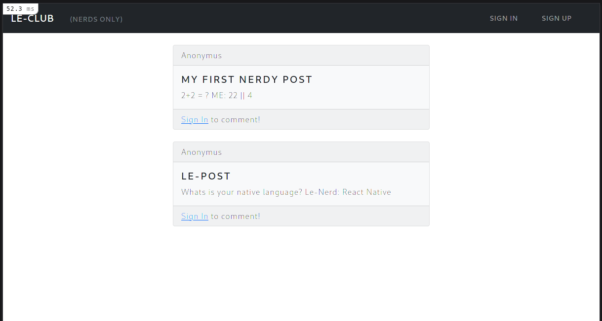
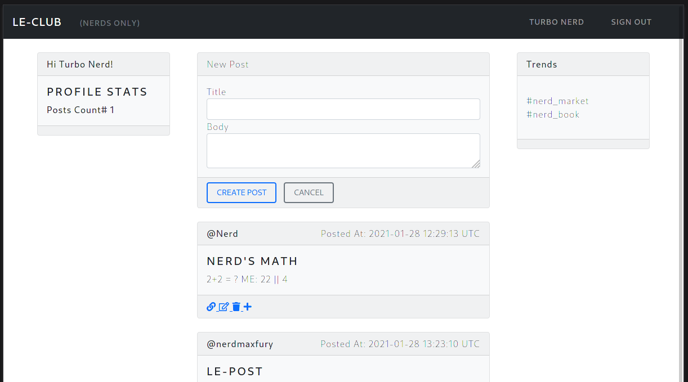

# Members Only

## Description

A simple useless fun private social Nerd's club made to practice Rails skill, following the instructions from [The Odin Project](https://www.theodinproject.com/courses/ruby-on-rails/lessons/authentication).

Basic concepts of Ruby on Rails have been used, including:

- Models, Views, and Controllers (MVC)
- Data Structures & Relationships
- Routing
- Migrations
- Views with forms, partials, and helpers
- RESTful design
- Authentication, sessions and cookies
- Gems Used: Bootstrap, Devise, Guard 

## To install and run

- Clone the project repo from [GitHub](https://github.com/krishnzzz/members-only) using `git clone https://github.com/krishnzzz/members-only`
- Make sure [Ruby-lang](https://www.ruby-lang.org/en/) version-2.7.2 is installed
- Make sure [Bundler](https://bundler.io/) is installed
- Install the required gems. Run `bundle install`
- Install the locale database. Run `rake db:migrate`
- If you have problems with the gem versions try installing [RVM](https://rvm.io/)
- Launch a Rails Server using `rails server`
- Open your browser and go to `127.0.0.1:3000` or `localhost:3000`

## Screenshot

### As Guest

### As Registered User

## Designed With
- Ruby
- Rails
- Bootstrap
- SCSS
- Git
- Gitflows
- Rubocop
- Stylelint
- VS Code

## Contribute to this Project

Contributions, issues, and feature requests are welcome! Start by:

  - Forking the project
  - Cloning the project to your local machine
  - cd into the project directory
  - Run git checkout -b your-branch-name
  - Make your contributions
  - Push your branch up to your forked repository
  - Open a Pull Request with a detailed description of the development branch of the original project for a review

## Authors

👤 **Muhammad Adeel Danish**

- Github: [@bashforger](https://github.com/bashforger)
- Twitter [@bashforge](https://twitter.com/BashForge)
- LinkedIn: [@m-adeel-danish](https://www.linkedin.com/in/muhammad-adeel-danish/)

## Show your support
Give a ⭐️ if you like this project!
